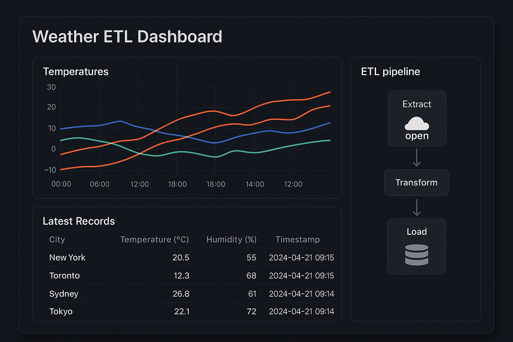

# Weather ETL Dashboard



A real-time dashboard showcasing current weather data across multiple cities, powered by a streaming ETL pipeline and built with React, Vite, and Tailwind CSS.

## Features

* **Live Temperatures**: Displays current temperatures for each city in a responsive line chart, updated automatically every minute.
* **Latest Records Table**: Shows the most recent weather record per city, including humidity and timestamp.
* **ETL Pipeline Visualization**: Illustrates the Extract → Transform → Load steps and continuously ingests new data.
* **Auto-Refresh**: No manual trigger required—frontend polls the API every minute for fresh data.
* **Dark Mode UI**: Fully dark-themed interface with Tailwind CSS and Lucide icons.

## Live Demo

*Deployed demo coming soon.*

## Tech Stack

* **Frontend**: React, Vite, TypeScript, Tailwind CSS, Recharts, Lucide-React
* **Backend**: FastAPI
* **ETL**: Python scripts, PostgreSQL, Docker

## Getting Started

### Prerequisites

* Node.js >= 18
* npm or yarn
* Docker & Docker Compose (for backend + ETL)

### Installation

1. **Clone the repository**

   ```bash
   git clone https://github.com/AzamatMuminov/etl-pipeline-api.git
   cd etl-pipeline-api
   ```

2. **Configure environment**

   Create a `.env` file in the project root with:

   ```dotenv
   VITE_ETL_API_URL=http://localhost:8000
   OPENWEATHER_API_KEY=your_openweathermap_key
   ```

3. **Run backend & ETL pipeline**

   ```bash
   docker compose up --build
   ```

4. **Install frontend dependencies**

   ```bash
   cd frontend
   npm install
   ```

5. **Start the dashboard**

   ```bash
   npm run dev
   ```

   Open your browser at `http://localhost:5173`.

## Project Structure

```
etl-pipeline-api/
├─ api/                # FastAPI backend
├─ etl/                # Python ETL scripts
├─ frontend/           # React + Vite dashboard
│  ├─ src/
│  │  ├─ pages/        # ETLPipelineDashboard.tsx
│  │  └─ ...
│  └─ tailwind.config.js
└─ docker-compose.yml  # Spins up API, ETL, and Postgres
```

## Customization

* **Poll interval**: Change refresh interval in `ETLPipelineDashboard.tsx` (`setInterval` duration).
* **Cities**: Modify the list of tracked cities in the ETL script or `.env`.
* **Styling**: Adjust Tailwind utility classes in components.

## Future Improvements

* Add historical trends and date range selection.
* Alerting thresholds for extreme weather.
* Export data as CSV or PDF reports.

---

© 2025 Azamat Muminov
